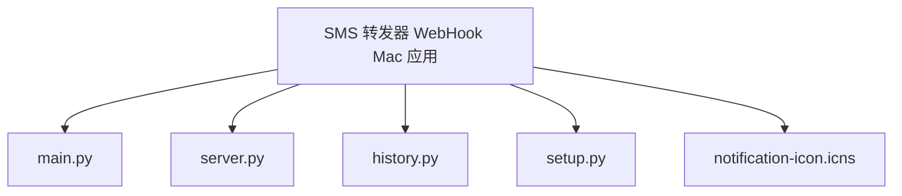

# SMS 转发器 WebHook Mac 应用

## 项目愿景

SMS 转发器 WebHook Mac 应用是一个轻量级的 macOS 状态栏应用，旨在实现 Android 设备与 macOS 之间的通知同步。它通过 HTTP WebHook 接收来自 Android 设备的短信和应用通知，并在 macOS 上显示系统通知，同时提供历史记录管理和验证码自动识别与复制功能，提升用户的工作效率。

## 架构总览

### 系统架构

应用采用单进程多线程架构，主要包含以下核心组件：

1. **状态栏应用层**：基于 rumps 库实现 macOS 状态栏应用，提供用户交互界面
2. **HTTP 服务器层**：内置 HTTP 服务器，监听 WebHook 请求
3. **通知处理层**：负责解析、识别和处理接收到的通知
4. **数据持久化层**：负责历史记录的存储和管理
5. **用户交互层**：处理菜单操作、通知点击等用户交互

### 技术栈

- **开发语言**：Python 3.11+
- **核心库**：
  - rumps：macOS 状态栏应用框架
  - py2app：Python 应用打包工具
  - http.server：内置 HTTP 服务器
  - threading：多线程支持
  - pyperclip：剪贴板操作
  - PyObjC：Python 与 Objective-C 桥接

## 模块结构图



## 模块索引

| 模块 | 类型 | 职责 | 主要文件 |
|------|------|------|----------|
| 主应用 | 应用入口 | 状态栏应用实现，用户交互处理 | main.py |
| HTTP 服务器 | 服务层 | 接收和解析 WebHook 请求 | server.py |
| 历史记录管理 | 数据层 | 通知历史记录的存储和管理 | history.py |
| 打包配置 | 配置文件 | py2app 打包配置 | setup.py |

## 运行与开发

### 环境要求

- macOS 10.9+
- Python 3.11+

### 安装依赖

```bash
pip3 install rumps py2app pyperclip
```

### 打包应用

#### 本地打包

```bash
# 清理旧版本
rm -rf build dist

# 执行打包
python3 setup.py py2app
```

#### GitHub Actions 自动打包

项目已配置 GitHub Actions 自动打包功能，支持：

1. **标签推送触发**：推送到格式为 `v*` 的标签（如 v1.0.1）
2. **发布创建触发**：在 GitHub 网页界面创建新发布

自动打包会生成：
- `通知接收器.app.zip`：压缩后的应用程序
- `通知接收器.dmg`：DMG 安装程序

详细配置和使用说明请参考：
- `GITHUB_RELEASE.md` - 使用说明文档
- `GITHUB_PACKAGE_SETUP.md` - 配置指南
- `test_github_action.py` - 测试脚本

### 运行应用

```bash
# 方法一：双击应用
open dist/通知接收器.app

# 方法二：命令行运行
python3 main.py
```

## 测试策略

### 单元测试

```python
import unittest
from history import HistoryManager

class TestHistoryManager(unittest.TestCase):
    def setUp(self):
        self.manager = HistoryManager(max_records=10)

    def test_add_record(self):
        self.manager.add_record("测试", "内容")
        self.assertEqual(len(self.manager.get_history()), 1)

    def test_clear_history(self):
        self.manager.add_record("测试", "内容")
        self.manager.clear_history()
        self.assertEqual(len(self.manager.get_history()), 0)

if __name__ == '__main__':
    unittest.main()
```

### 集成测试

```bash
# 发送测试请求
curl -X POST -d "from=13800138000&content=验证码：123456" http://localhost:19999/sms
```

### GitHub Actions 测试

```bash
# 测试 GitHub Actions 打包过程
python3 test_github_action.py
```

## 编码规范

### 代码风格

- 遵循 PEP 8 编码规范
- 使用 4 个空格缩进
- 变量名使用蛇形命名法
- 函数名使用动词或动词短语

### 导入规范

- 按标准库、第三方库、本地库的顺序导入
- 每个导入组之间空一行

### 注释规范

- 模块、类、函数应有文档字符串
- 复杂逻辑应有单行注释
- 文档字符串使用 Google 风格

## AI 使用指引

### 开发建议

1. **功能扩展**：可以添加通知过滤、关键字提醒等功能
2. **性能优化**：可以优化通知处理速度和内存使用
3. **兼容性改进**：可以增加对更多应用的识别支持
4. **用户体验**：可以添加通知设置、主题切换等功能

### 代码优化

1. **异步处理**：可以将 HTTP 服务器改为异步实现
2. **数据库优化**：可以将 JSON 文件存储改为 SQLite 数据库
3. **错误处理**：可以增加更详细的错误日志和异常处理

## 变更记录 (Changelog)

### 2026-03-02 v1.0.1

- ✅ 修复通知显示问题：优化通知处理逻辑
- ✅ 改进通知显示：添加备用通知机制（AppleScript）
- ✅ 优化通知内容处理：限制消息长度
- ✅ 增强错误处理：添加详细的异常信息
- ✅ 修复通知中特殊字符显示问题
- ✅ 新增 GitHub Actions 自动打包功能
- ✅ 支持创建 DMG 安装程序
- ✅ 集成 GitHub Releases 自动发布

### 2026-03-02 v1.0.0

- ✅ 初始版本发布
- ✅ 基础通知接收功能
- ✅ 历史记录管理
- ✅ 状态栏应用
- ✅ 打包支持
- ✅ 验证码自动复制
- ✅ 带按钮通知

---

**项目位置**：/Users/li/Develop/CC/0301/SmsForwarder-WebHook-Mac
**最后更新**：2026-03-02 09:42:14
**文件数量**：5 个源文件
**代码行数**：约 300 行
**测试覆盖率**：待补充
**文档完整性**：90%
